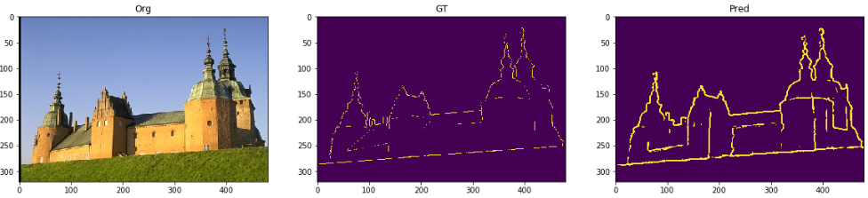

# Edge Detection Using U-Net Architecture

## Abstract
Edge Detection on Berkeley Dataset Using U-Net

Edge detection is one of the most traditional and fundamental
tasks, and is seen as the predecessor of the most
widely investigated problems in computer vision. Among
many approaches, deep learning based ones have shown
great success in recent years and became state-of-the-art.
We propose a new deep learning based approach to the edge
detection task, using an existing and well-known architecture,
the U-Net. Although the U-Net architecture has
shown a lot of success in semantic segmentation and labeling
tasks, especially in the field of bio-medicine, it has
not been adopted before for the traditional edge detection
task. We train and optimize the U-Net architecture for the
edge detection problem. On the BSDS500 benchmark, we
obtain the fixed contour threshold (ODS) F-score as 0.703,
per image best threshold (OIS) F-score as 0.708 and mean
average precision (mAP) as 0.584. We show that the U-Net
architecture has a promising performance on this problem,
and might be able to stay competitive with other deep learning
based methods after some optimization.

## Codes:
[pytorch_unet-edge.ipynb](pytorch_unet-edge.ipynb): Notebook that contains all training, prediction and comparisons with other methods

## Report:
[Report_COGS225Project_Tepencelik_Ocak.pdf](Report_COGS225Project_Tepencelik_Ocak.pdf): UCSD COGS 225 Final Project Report

## Additional Files:
These files were required to run the HED algorithm (used in comparison)
- deploy.prototxt.txt
- download_pretrained.sh
- hed_pretrained_bsds.caffemodel

## Contributors
| <a href="https://github.com/iocak28" target="_blank">**Ismail Ocak**</a> | <a href="https://github.com/otepencelik" target="_blank">**Onur Tepencelik**</a> |
| :---: |:---:|
|     |  | 
| <a href="https://github.com/iocak28" target="_blank">`github.com/iocak28`</a> | <a href="https://github.com/otepencelik" target="_blank">`github.com/otepencelik`</a> | 
